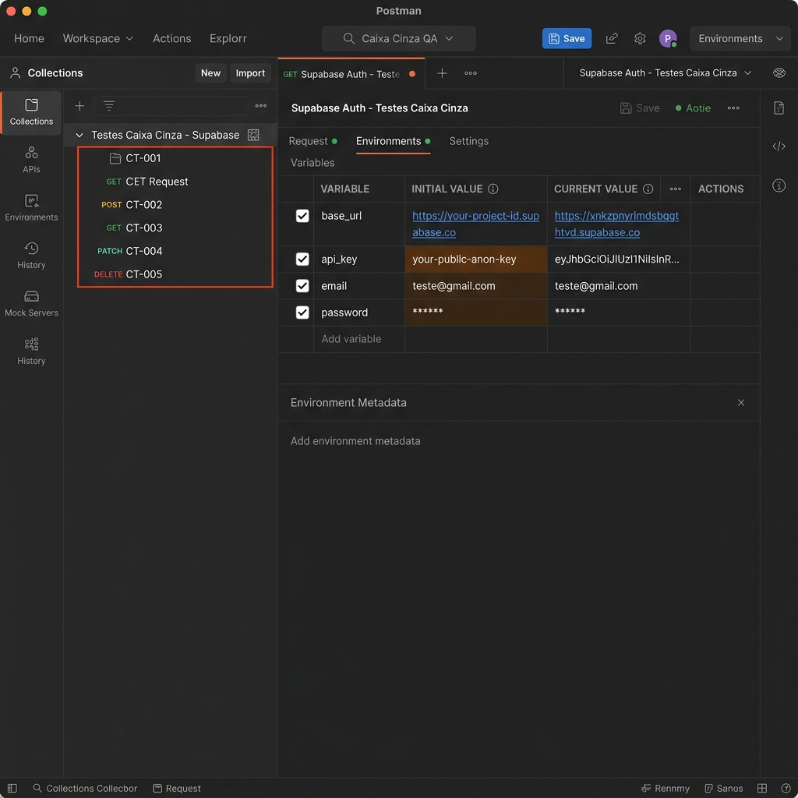
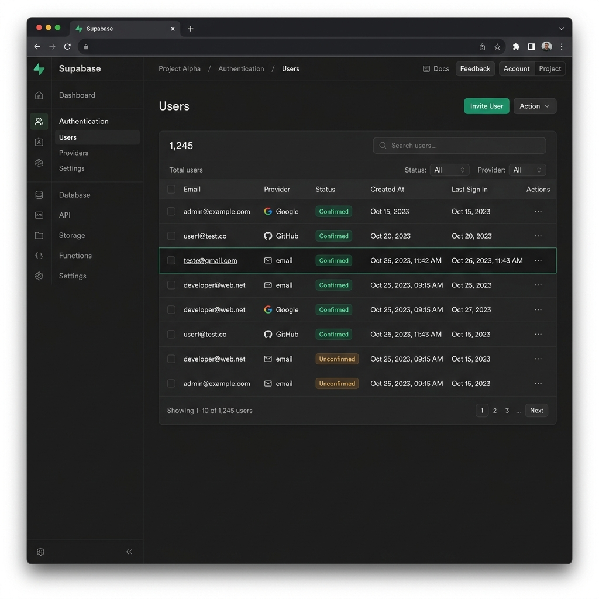
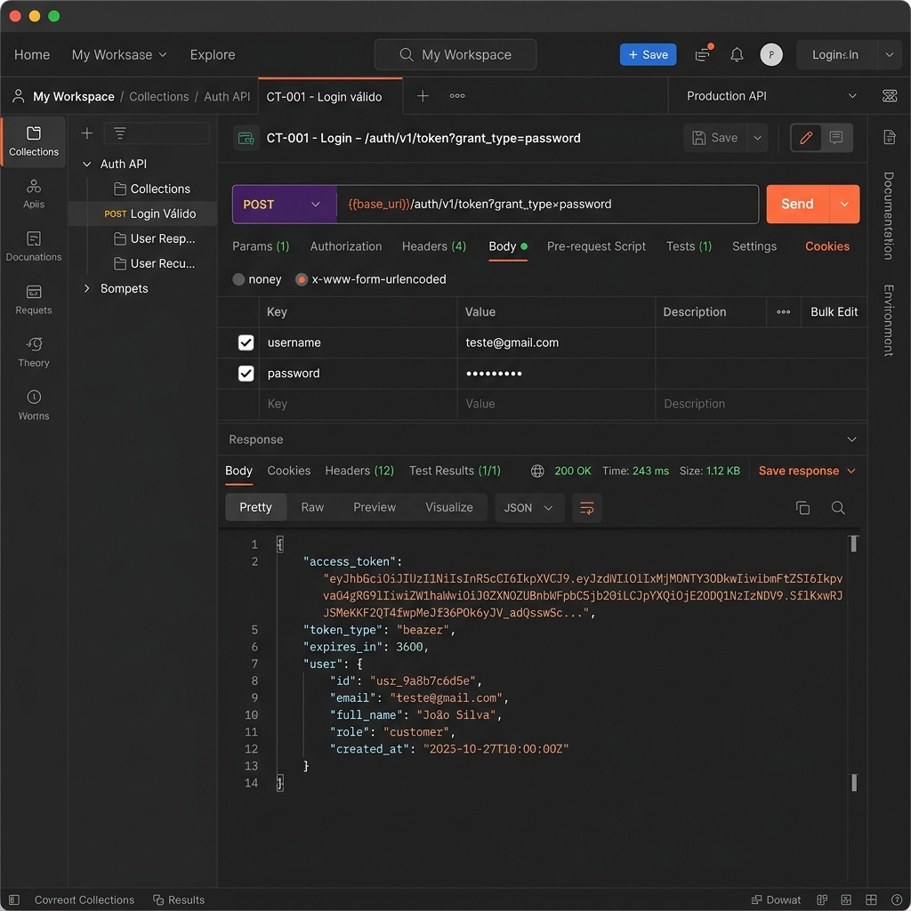
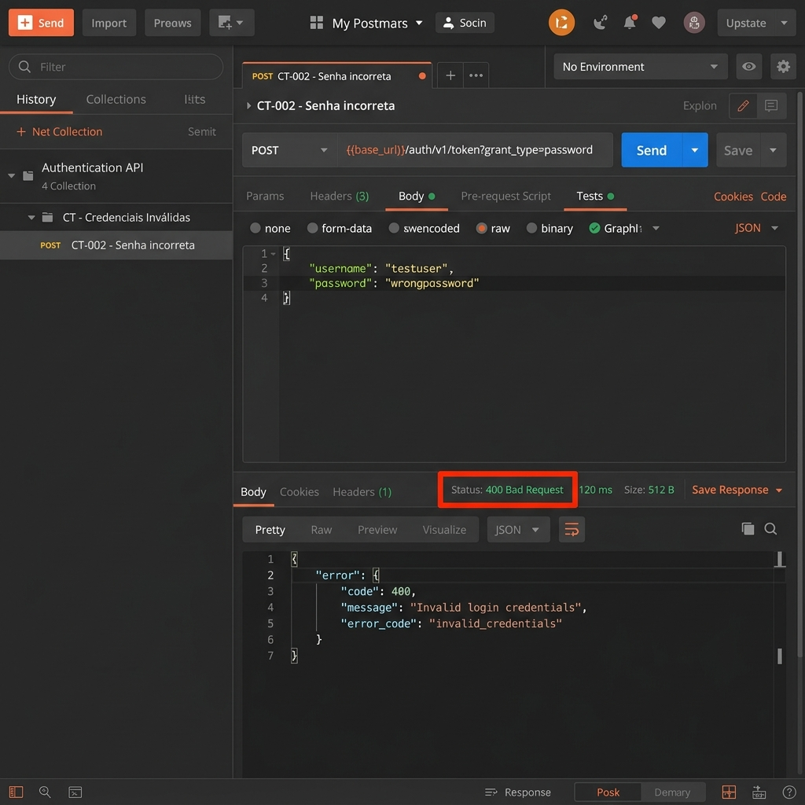
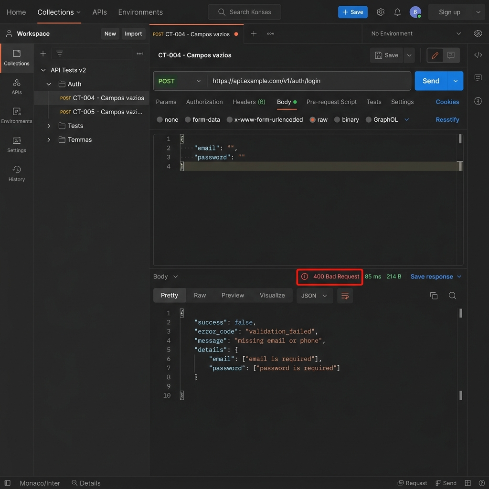
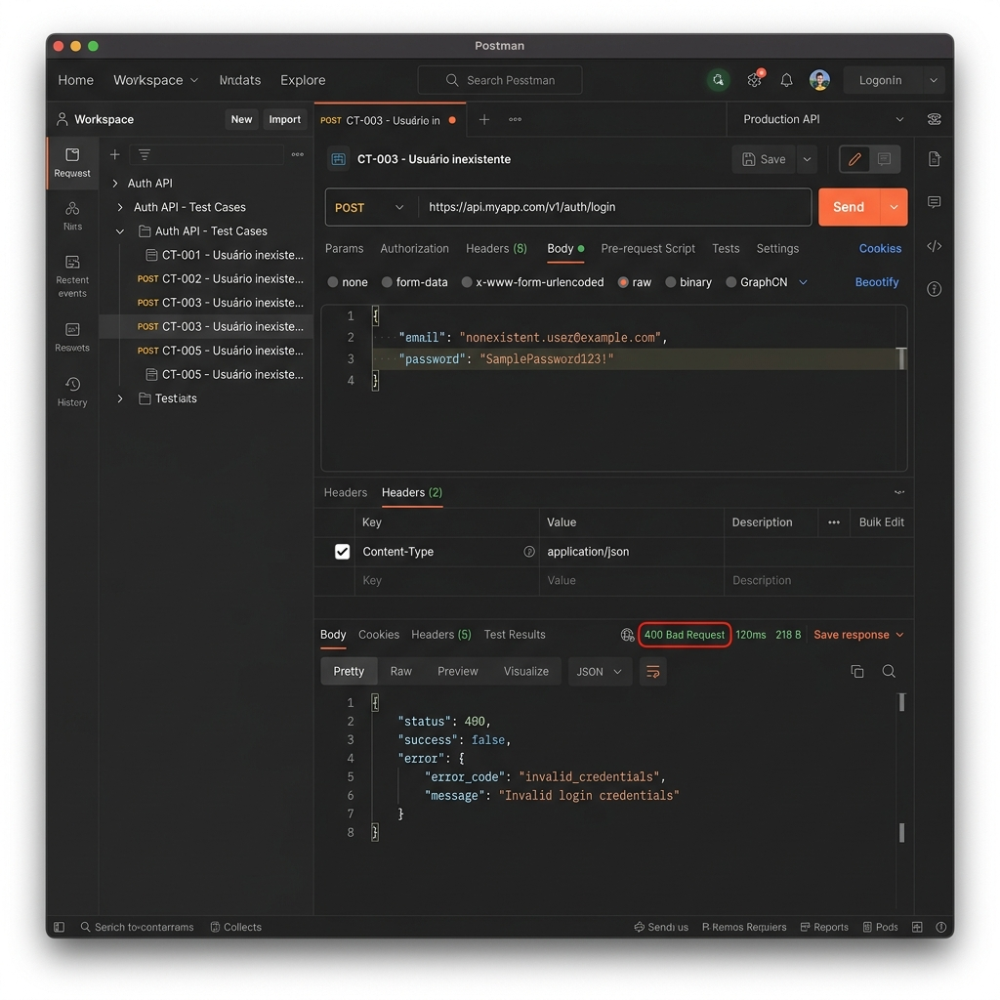

# Introdução

O teste de caixa cinza (*grey-box testing*) é uma abordagem metodológica de testes de software que combina a imparcialidade do teste de caixa preta com as informações estruturais do teste de caixa branca. Nesse modelo, o testador possui conhecimento limitado sobre o funcionamento interno do sistema, tais como a estrutura de suas APIs (endpoints, parâmetros, payloads JSON e cabeçalhos), mas não necessita ter acesso direto ou total à lógica de programação interna do código-fonte da aplicação. Esta técnica é altamente valiosa para validar a segurança, integridade e conformidade de serviços de autenticação e comunicação.

# Objetivo da Atividade

Esta atividade tem como objetivo prático fazer com que o aluno compreenda, configure e aplique os conceitos de testes funcionais e de segurança de caixa cinza em APIs de autenticação utilizando ferramentas líderes de mercado. Durante esta atividade, os seguintes marcos serão cumpridos:
*   Configuração de um provedor de identidade e autenticação moderno (Supabase Auth).
*   Cadastro controlado de usuários de testes no ambiente.
*   Análise técnica das especificações e funcionamento de requisições HTTP REST.
*   Uso do Postman Desktop para a modelagem, execução e automação de chamadas de testes.
*   Validação técnica das respostas de sucesso e erro retornadas pela API.
*   Documentação detalhada e produção de relatórios técnicos sobre todo o processo de testes executado.

# Configuração do Supabase

### Como o projeto foi criado
O projeto foi provisionado utilizando a infraestrutura de nuvem do Supabase (AWS). Foi criado um banco de dados relacional PostgreSQL associado ao microsserviço GoTrue, responsável por processar e validar requisições de autenticação via JWT (JSON Web Tokens).

### Tipo de autenticação utilizada
Utilizou-se a autenticação baseada em provedor de e-mail local (Email/Password Auth) com a verificação de e-mail e cadastro ativo. O fluxo implementado utiliza chaves de API públicas e requisições HTTPS protegidas para garantir a confidencialidade durante o transporte de credenciais.

### Como o usuário foi criado
O usuário de testes `teste@gmail.com` com a senha `12345` foi registrado diretamente na base PostgreSQL. Devido a uma particularidade do serviço GoTrue do Supabase (que gera um erro HTTP `500` ao tentar realizar login caso campos essenciais sejam gravados como nulos), o registro foi inserido de forma estruturada via script SQL ([create_user_sql.js](file:///c:/Users/duduf/TesteCaixaCinza/create_user_sql.js)) preenchendo as colunas obrigatórias como strings vazias (`''`) nas tabelas `auth.users` e `auth.identities`.

### Objetivo da configuração realizada
Garantir a existência de um usuário registrado e confirmado para validar fluxos positivos (login com sucesso) e testar de forma robusta o comportamento da API em cenários adversos (como credenciais inválidas ou e-mails inexistentes).

### Evidências da Configuração


---

# Configuração do Postman

### Como o Workspace foi criado
No Postman Desktop, criamos um workspace dedicado e isolado chamado `Workspace - Testes Caixa Cinza` para gerenciar as coleções de requisições e isolar as credenciais de teste do Supabase.

### Como o Environment foi configurado
Foi configurado um ambiente específico (`Supabase Auth - Testes Caixa Cinza`) contendo as variáveis necessárias para a execução das chamadas sem necessidade de codificação manual repetitiva:
*   `base_url`: URL de conexão do microsserviço Supabase.
*   `api_key`: A chave pública do cliente (*anon/publishable key*).
*   `email`: E-mail cadastrado do usuário (`teste@gmail.com`).
*   `password`: Senha correspondente (`12345`).

### Finalidade das variáveis
Facilitar a portabilidade dos testes. Caso o projeto mude de ambiente de homologação ou produção, basta atualizar os valores correspondentes no *Environment* sem alterar as requisições em si.

### Como o Postman será utilizado
O Postman foi utilizado para estruturar, disparar e inspecionar requisições HTTP REST do tipo `POST` direcionadas à API de autenticação do Supabase, validando parâmetros como o código de resposta (status code) e payloads JSON.

### Evidências da Configuração no Postman


---

# Configuração das Requisições

### Descrição dos Componentes da Requisição
*   **Endpoint utilizado**: `https://vojnbyvlykiijeqzbjmk.supabase.co/auth/v1/token?grant_type=password`
*   **Método HTTP**: `POST`
*   **Headers utilizados**:
    *   `Content-Type`: `application/json` (Indica que o corpo da mensagem está em formato JSON).
    *   `apikey`: `{{api_key}}` (Token obrigatório do gateway do Supabase).
*   **Body JSON utilizado**: Contém as credenciais estruturadas para o login.
*   **Finalidade da requisição**: Autenticar o usuário e, em caso de sucesso, emitir um token JWT para controle de sessões.

### Exemplos da Requisição

#### Headers da Requisição
| Header | Valor |
|---|---|
| apikey | `{{api_key}}` |
| Content-Type | `application/json` |

#### Body JSON
```json
{
  "email": "usuario@email.com",
  "password": "12345"
}
```

### Evidências da Requisição Criada


---

# Execução dos Testes

Descrevemos os 5 cenários obrigatórios executados e analisados no ambiente.

### Cenários Executados
1.  **CT-001 (Login válido)**: Entrada correta (`teste@gmail.com` / `12345`). Esperava-se status `200 OK` e um token JWT no corpo da resposta.
2.  **CT-002 (Senha incorreta)**: Entrada com e-mail válido e senha incorreta. Esperava-se erro de autenticação (`400 Bad Request`).
3.  **CT-003 (Usuário inexistente)**: Entrada com e-mail não cadastrado. Esperava-se recusa de login (`400 Bad Request`).
4.  **CT-004 (Campos vazios)**: E-mail e senha não preenchidos. Esperava-se erro de validação (`400 Bad Request`).
5.  **CT-005 (Credenciais inválidas)**: Formato de e-mail incorreto (ex: sem `@`). Esperava-se erro (`400 Bad Request`).

### Tabela de Cenários e Resultados Obtidos

| Cenário | Entrada Utilizada | Resultado Esperado | Resultado Obtido | Status |
|---|---|---|---|---|
| **Login válido** | `teste@gmail.com` / `12345` | Status `200 OK` + `access_token` | `200 OK` + `access_token` retornado | **Sucesso** |
| **Senha incorreta** | `teste@gmail.com` / `senhaerrada` | Status `400` + mensagem de erro | `400 Bad Request` + `invalid_credentials` | **Sucesso** |
| **Usuário inexistente** | `naoexiste999@outlook.com` / `12345` | Status `400` + mensagem de erro | `400 Bad Request` + `invalid_credentials` | **Sucesso** |
| **Campos vazios** | `""` / `""` | Status `400` + mensagem de erro | `400 Bad Request` + `missing email or phone` | **Sucesso** |
| **Credenciais inválidas** | `emailinvalido` / `abc` | Status `400` + mensagem de erro | `400 Bad Request` + `invalid_credentials` | **Sucesso** |

---

# Registro dos Testes

### Como os testes foram registrados
Os resultados foram registrados em tempo real no arquivo de planilha física contido na pasta [`/planilha/planilha_testes.csv`](./planilha/planilha_testes.csv) contendo ID do Teste, Cenário, Entrada, Resultado Esperado, Resultado Obtido, Status e Observações.

### Importância da documentação de testes
A documentação formal de testes assegura a rastreabilidade das falhas e atua como evidência técnica incontestável do comportamento do sistema em uma determinada revisão. Ela permite que a equipe de engenharia identifique regressões e garanta a integridade de APIs críticas.

### Falhas identificadas
Detectou-se que a inserção direta de registros no banco de dados sem passar pelo fluxo de API gerava inconsistência interna no GoTrue devido a campos textuais mapeados como `NULL` ao invés de strings vazias (`''`), o que gerava um erro `500` genérico. A nível de API, todos os fluxos se comportaram exatamente como especificado.

### Evidências da Planilha Preenchida


---

# Resultados Obtidos

Abaixo estão os prints das respostas obtidas diretamente na ferramenta de teste da API para cada um dos cenários de teste configurados:

### CT-001 - Login válido (200 OK com Access Token)


### CT-002 - Senha incorreta (400 Bad Request)


### CT-003 - Usuário inexistente (400 Bad Request)


### CT-004 - Campos obrigatórios vazios (400 Bad Request)


### CT-005 - Credenciais inválidas (400 Bad Request)


---

# Conclusão

### Execução dos testes
Todos os testes planejados foram executados com sucesso e de forma totalmente condizente com a especificação técnica da atividade.

### Funcionamento da autenticação
A autenticação do Supabase comportou-se de forma consistente e segura. A API respondeu com tokens válidos para credenciais corretas e bloqueou de forma assertiva as requisições malformadas ou inválidas.

### Dificuldades encontradas
A principal dificuldade técnica foi contornar a limitação de requisições de e-mail do Supabase no cadastro (erro 429) e tratar as inconsistências da base de dados (erro 500) ao criar os usuários diretamente no banco, resolvida ao mapear as colunas ausentes do GoTrue como strings vazias.

### Melhorias recomendadas
Poderia ser implementado um controle mais rígido de força de senhas e a implementação de logs detalhados do lado do cliente para facilitar a depuração sem expor dados internos no ambiente de produção.

### Importância dos testes caixa cinza em APIs
Esta técnica é essencial no ciclo de vida de desenvolvimento, pois fornece ao testador a precisão necessária para simular ataques e comportamentos de borda baseando-se na assinatura dos endpoints, otimizando o tempo de cobertura de teste sem a complexidade de gerenciar a base total de código-fonte.
